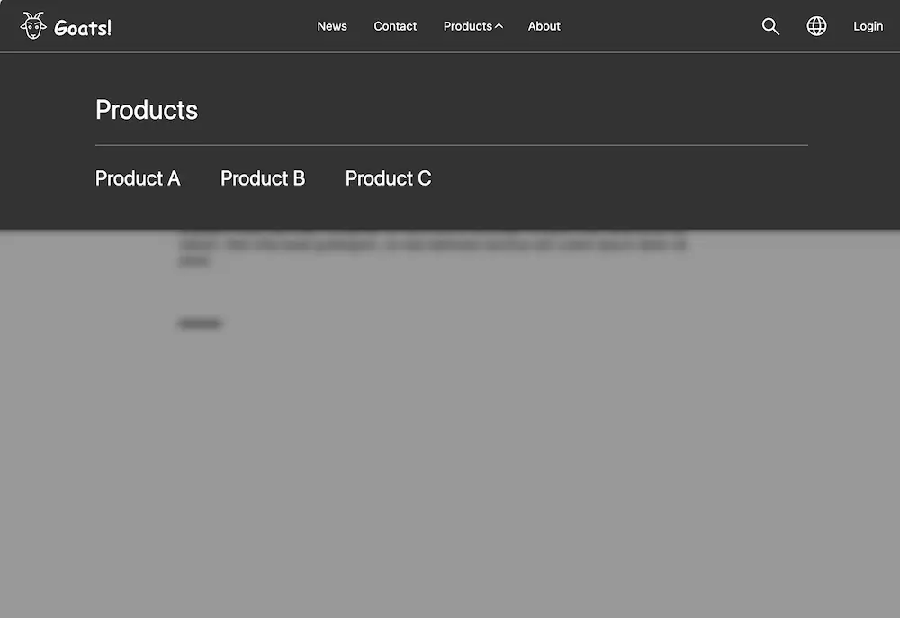

# TYPO3 Goat Header

Example implementation of a header and navigation component.

- [Figma](https://www.figma.com/file/K0TmeMfaSVa7Uo7fBTUkJs/Navigation-Pattern?node-id=4:1173&mode=dev)

## Prerequisites

- [Docker Desktop or Colima](https://ddev.readthedocs.io/en/latest/users/install/docker-installation/)
- [DDEV](https://ddev.readthedocs.io/en/latest/)
- [Mutagen](https://ddev.readthedocs.io/en/latest/users/install/performance/#mutagen) needs to be enabled for HMR

## Local installation guide

	git clone https://github.com/fgeierst/typo3-goat-header.git
	cd typo3-goat-header
	ddev start
	ddev exec cp .env.example .env
	ddev composer install
    ddev pnpm install
	ddev snapshot restore --latest

Login using these credentials:

- Username: `admin`
- Password: `oZim4R7eLEWzzL`

## Vite development server

The development server is already running in the background (started by `ddev start`). You can control it with

	ddev vite-serve start|stop

Running `ddev pnpm dev` does the same, but shows Vite's output in the terminal.

## Test the production build

	ddev pnpm build

Switch applicationContext to production in _.env_ (or in .ddev/config.yaml under web_environment)

	# TYPO3_CONTEXT="Development/Local"
	TYPO3_CONTEXT="Production/Staging"
